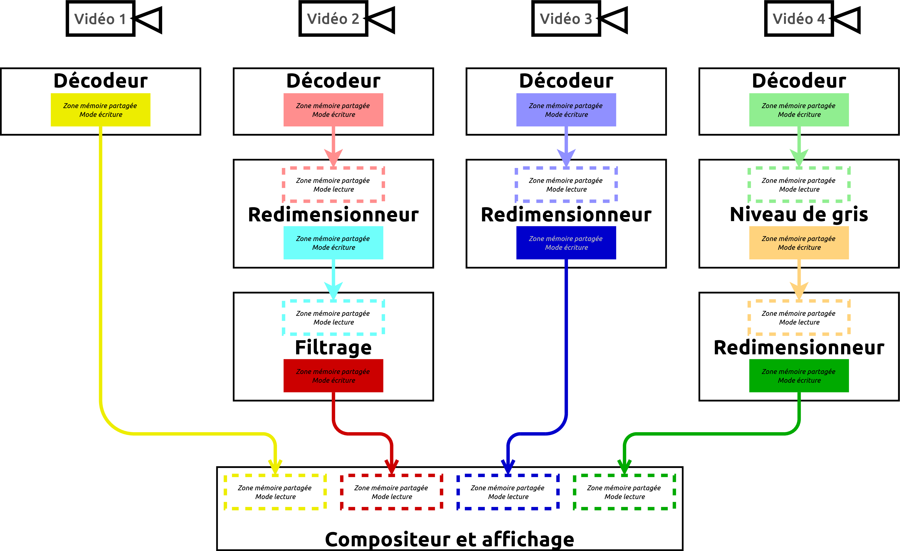
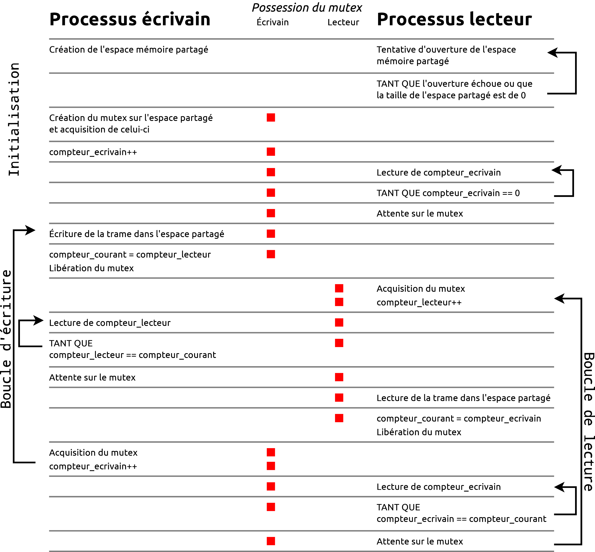
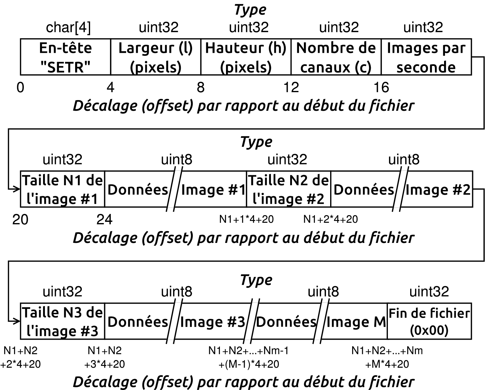
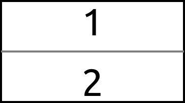
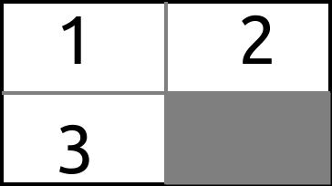
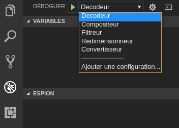

## 1. Objectifs

Ce travail pratique vise les objectifs suivants :

1. Mettre en place une arborescence de processus temps réel sur un système embarqué;
2. Comprendre la communication interprocessus par mémoire partagée;
3. Se familiariser avec les primitives de synchronisation spécifiques au temps réel, en particulier pour éviter le problème de l'inversion de priorité;
4. Analyser l'impact des différents modes d'ordonnancement offerts par le noyau Linux;
5. Utiliser une projection en mémoire (*memory map*) pour la lecture d'un fichier;
6. Implémenter un système temps réel sur une plateforme limitée en puissance de calcul et comprendre les optimisations à apporter lors de la compilation.

## 2. Présentation du projet

Dans ce laboratoire, votre tâche est d'implémenter un système de multiplexage de vidéos qui pourrait, par exemple, être intégré dans un système de surveillance. Plus formellement, vous devez lire plusieurs vidéos en parallèle, appliquer certains effets sur ces derniers (redimensionnement, filtrage, passage en niveaux de gris, etc.), puis les *composer* dans un affichage qui permet de les voir simultanément. Votre système doit être en mesure de prioriser les divers programmes le composant afin d'obtenir une bonne fluidité (mesurée en images par seconde). En particulier, le fait qu'une source vidéo requiert trop de ressources (et ne soit donc pas en mesure d'offrir un affichage fluide) ne doit pas empêcher les *autres* d'être fluides. Ce système doit fonctionner sur le même principe que les *pipes*, au sens où chaque programme doit pouvoir être chaîné avec les autres. Cependant, les processus ne communiqueront pas en utilisant des *pipes*, qui sont peu adaptés à un système temps réel, mais plutôt via des zones mémoire *partagées*. Par ailleurs, l'affichage des vidéos est effectué à un très bas niveau afin d'éviter les délais imprédictibles causés par l'utilisation d'un serveur d'affichage classique.


## 3. Préparation et outils nécessaires

Ce laboratoire ne nécessite l'installation d'aucune librairie particulière. Comme pour le laboratoire 2, un projet VScode vous est fourni avec des scripts de configuration et une première structure de code. Vous pouvez le récupérer sur le dépôt Git suivant : [https://github.com/setr-ulaval/labo3-h22](https://github.com/setr-ulaval/labo3-h22). Ce dépôt contient aussi des fonctions qui vous sont fournies pour implémenter certaines fonctionnalités du système. De même, plusieurs fichiers d'en-tête (*headers*) vous sont fournis afin de vous guider dans l'implémentation du système. Votre Raspberry Pi Zero devra _être branché sur un écran_ pour pouvoir observer le résultat, puisque nous écrivons directement dans la mémoire du GPU. Utilisez le convertisseur mini-HDMI à HDMI qui vous a été fourni à cet effet.

> **Note** : comme pour le laboratoire 2, vous **devez** modifier les fichiers `.vscode/launch.json` et `syncAndStartGDB.sh` pour y écrire l'adresse de votre Raspberry Pi. Attention, dans le cas du fichier `launch.json`, vous devez le faire à **5** endroits. Assurez-vous également que le dossier `/home/pi/projects/laboratoire3` existe sur votre Raspberry Pi.


### 3.1. Fichiers de test

Afin de vous permettre de tester votre approche, nous vous fournissons des [vidéos adaptées au projet](http://wcours.gel.ulaval.ca/2020/h/GIF3004/default/lab3_videos_ULV.zip) (attention : taille de 670 Mo!). Ceux-ci sont issus [des projets de la Fondation Blender](https://www.blender.org/features/projects/) et peuvent être distribués librement. Vous pouvez tester votre projet avec d'autres vidéos, mais assurez-vous que vous possédez les droits pour le faire. Notez que ces vidéos sont encodées de manière spéciale et que vous ne serez pas capables de les ouvrir avec un lecteur classique. Nous reviendrons plus loin sur les spécificités de ce format.


## 4. Architecture générale

La figure suivante expose l'architecture générale du système.



Dans ce diagramme, chaque boîte correspond à un processus distinct. C'est donc dire qu'il y a 10 processus actifs dans le système exposé plus haut. Toutes les communications entre les processus se font via des espaces mémoire partagés. La plupart des processus acceptent à la fois un espace partagé en entrée et en sortie. Les processus décodeurs n'utilisent cependant qu'une sortie, puisque leur entrée est constituée d'un fichier vidéo. De même, le compositeur possède plusieurs entrées (une pour chaque flux vidéo), mais n'a pas de sortie, puisqu'il affiche directement le résultat à l'écran.

Tous les processus sont des processus avec des contraintes temps réel et la plupart possèdent des dépendances (par exemple, le processus de filtrage de la seconde colonne doit attendre le résultat du processus de redimensionnement, qui nécessite lui-même le résultat du processus de décodage). Il deviendra donc crucial d'assurer un bon ordonnancement de ceux-ci.

### 4.1. Création d'un espace mémoire partagé

Un espace mémoire partagé peut être créé en utilisant la fonction `shm_open`. Cet espace mémoire possédant initialement une taille de zéro, il faut donc l'agrandir en utilisant la fonction `ftruncate`. Finalement, cet espace est, par défaut, vu comme un fichier. Pour faciliter son utilisation, nous utilisons un appel `mmap` qui permet d'utiliser cet espace d'échange comme un pointeur normal. La structure de cette zone mémoire partagée est présentée à la figure suivante.


Les quatre premiers octets permettent de stocker une primitive de synchronisation. Les huit octets suivants contiennent des compteurs permettant de déterminer la trame sur laquelle travaillent les processus écrivain et lecteur (et ainsi éviter de traiter deux fois la même trame). Les 12 octets suivants rapportent des informations à propos des images qui seront transmises. Ils sont suivis d'un entier indiquant le nombre d'images par seconde fournies par la source vidéo. Finalement, les données sont présentées sous la forme d'un tableau de *char*, dont la longueur dépend des dimensions de l'image.

### 4.2. Synchronisation

La communication se faisant par espace mémoire partagé, il est important que les différents processus soient synchronisés. Par exemple, lorsque le processus écrit dans la mémoire, le lecteur doit attendre la fin de cette écriture pour lire, au risque de se retrouver avec une image composée de deux trames différentes. De même, si le processus écrivain ne peut fournir un débit suffisant, le processus lecteur ne doit pas recommencer le traitement de la même trame.

Le problème de synchronisation est complexifié par le fait qu'il faille gérer *l'inversion de priorité*. Cela signifie que nous devons configurer les mutex avec les attributs leur permettant d'être partagés entre les processus et de tenir compte de potentielles inversions de priorité.

Un mutex peut être référencé par un simple pointeur. Il est donc possible de le partager facilement dans un espace mémoire partagé. Dans notre cas, il nous permet de bloquer le lecteur tant que l'écrivain n'a pas écrit une trame complète et de bloquer l'écrivain tant que le lecteur n'a pas copié l'entièreté de la trame. Vous êtes libres de concevoir votre propre algorithme de synchronisation adapté à ce problème, mais nous vous fournissons une approche fonctionnelle que vous pouvez utiliser. Celle-ci est illustrée à la figure suivante.


Dans ce diagramme, l'axe temporel va de haut en bas. On peut distinguer trois sections distinctes : l'initialisation, l'écriture d'une trame et la lecture d'une trame. Celles-ci sont détaillées dans le texte qui suit.

L'initialisation permet de s'assurer que les processus commencent leur tâche dans un état connu, et ce peu importe l'ordre dans lequel ils ont été lancés. La création de l'espace mémoire partagé est toujours effectuée par le processus écrivain. Le processus lecteur se contente de tenter de l'ouvrir et recommence tant que cette opération échoue. Comme il est également possible que l'écrivain ait créé l'espace partagé mais ne l'ait pas encore agrandi, le lecteur doit également vérifier la taille de l'espace partagé en faisant appel à `fstat`. Si cette taille est plus grande que zéro, alors il attend que le compteur de l'écrivain ait été incrémenté. Le processus écrivain s'assure de son côté d'avoir *créé et acquis* le mutex avant d'incrémenter ce compteur. Lorsque le lecteur constate cette incrémentation, il se met en attente sur le mutex. À ce stade, l'écrivain peut commencer son travail et le lecteur sait qu'un écrivain actif est présent, nous passons donc à la boucle principale.

L'écrivain possédant le mutex, il peut modifier la zone mémoire partagée. Lorsqu'il a terminé, il conserve une copie de la valeur du compteur du lecteur puis libère le mutex. Le lecteur acquiert ce dernier et incrémente son compteur. Il peut alors lire le contenu de l'espace partagé sans risque de le voir être modifié. Lorsqu'il a terminé sa lecture, il copie la valeur du compteur de l'écrivain dans une variable locale puis libère le mutex. Du côté de l'écrivain, la première chose à faire lorsqu'il libère le mutex est de vérifier si le compteur du lecteur a été incrémenté : si ce n'est pas le cas, cela signifie que le lecteur n'a pas encore pu acquérir le mutex et donc que même si ce dernier est libre, il ne sert à rien de l'acquérir. L'écrivain boucle donc tant que le lecteur n'incrémente pas son compteur. Lorsque c'est le cas, l'écrivain sait que le lecteur possède le mutex et se met en attente sur ce dernier. Lorsque le lecteur a terminé et que l'écrivain récupère le mutex, il incrémente son compteur, ce qui permet au lecteur de savoir qu'il peut se remettre en attente sur le mutex, et le cycle recommence.

Le fichier *commMemoirePartagee.h* contient des déclarations de structure et de fonctions qui pourront vous être utiles pour implémenter l'algorithme de synchronisation. Créez vos fonctions dans un fichier nommé *commMemoirePartagee.c*. N'oubliez pas d'être générique : tous les programmes que vous écrirez ont besoin de ces primitives de synchronisation, il est donc souhaitable d'utiliser toujours les mêmes fonctions!

**Considérations importantes** : un processus temps réel ne peut être interrompu par le noyau (sauf cas spécifiques, selon l'ordonnanceur utilisé). Par conséquent, lorsque votre processus ne peut s'exécuter, vous *devez* redonner la main aux autres processus. Cela peut être fait de trois manières. Premièrement, en utilisant un appel système qui permet explicitement à l'ordonnanceur de vous interrompre (l'attente sur un mutex fait par exemple partie de ces opérations). Deuxièmement, en appelant la fonction `sched_yield` pour indiquer que vous acceptez volontairement de laisser le CPU à d'autres processus. Troisièment, en vous mettant volontairement en sommeil en utilisant `usleep`. La différence entre ces deux dernières approches est que `sched_yield` n'est qu'une **indication** donnée au noyau, qui peut très bien vous réveiller immédiatement sans passer à main à un autre processus s'il considère que vous êtes toujours le processus le plus prioritaire, alors que `usleep` force le noyau à ne pas vous réveiller pour la durée approximative que vous avez spécifiée. En d'autres termes, n'utilisez `sched_yield` que dans les cas où vous _pouvez_ laisser la main mais que vous auriez tout de même du travail à faire, et `usleep` lorsque vous n'avez rien à faire pour une période de temps approximativement connue (par exemple le temps avant la prochaine trame du vidéo).

Notez finalement que la plupart des programmes sont *à la fois* des lecteurs et des écrivains!

### 4.3. Gestion de la mémoire

Dans un programme standard, l'allocation mémoire peut se faire dynamiquement en utilisant par exemple `malloc`. Toutefois, dans un programme temps réel, cette fonction introduit des délais variables indésirables. Une fois dans la section critique d'un programme temps réel, *il faut donc se passer de malloc*. Par ailleurs, le noyau peut techniquement toujours *déplacer* des zones mémoire allouées, que ce soit ailleurs en mémoire ou sur le disque, ce qui n'est encore une fois pas souhaitable dans un cadre temps réel. Ces problèmes peuvent être réglés de la manière suivante :

1. Lors de l'initialisation du programme, lorsqu'il n'a pas encore commencé sa section critique, allouez dynamiquement (en utilisant *malloc*) une zone mémoire suffisamment grande pour contenir quatre ou cinq fois la taille des images que votre programme doit traiter. Vous pouvez par la suite remplacer les appels à *malloc* par une fonction personnalisée, par exemple *tempsreel_malloc*, qui va utiliser cette zone mémoire comme un bassin de mémoire (*memory pool*). Lorsqu'une partie de votre programme requiert une allocation mémoire, votre fonction va chercher s'il existe un emplacement libre dans ce bassin et la lui retourner. De même, lorsque la mémoire est libérée (par exemple en utilisant *tempsreel_free*), la fonction va indiquer que le bloc est maintenant libre.
2. Afin d'assurer que vos allocations mémoire vont rester en mémoire, utilisez la fonction `mlock` ou `mlockall`. Ces fonctions permettent de « fixer » un buffer en mémoire, au sens où le système d'exploitation garantit que leur emplacement ne changera pas tant que vous ne l'accepterez pas explicitement. Par défaut, un programme ne peut « fixer » un nombre limité d'octets. Vous pouvez utiliser la fonction *setrlimit* avec l'argument *RLIMIT_MEMLOCK* pour modifier cette valeur. Toutefois, votre programme devra alors être exécuté en tant que *root* (ou en utilisant `sudo`).

Des en-têtes implémentant une interface possible pour ce gestionnaire de mémoire simple vous est fourni dans *allocateurMemoire.h*. Implémentez vos fonctions dans un fichier nommé *allocateurMemoire.c*.

Afin d'éviter que vous ne dépassiez par inadvertance la capacité mémoire du Raspberry Pi, il vous est conseillé de désactiver le *swap* sur la carte SD avec la commande `sudo swapoff -a`.


### 4.4. Arguments des programmes

Tous les programmes possèdent une interface ligne de commandes similaire, soit :

```sh
./nomduprogramme [options] flux_entree flux_sortie
```

*flux_entree* et *flux_sortie* constituent respectivement les identifiants des zones mémoire partagées en entrée et en sortie. Les options sont quant à elles différentes selon les programmes. Parmi celles *devant être disponibles pour tous les programmes*, nous retrouvons :

* "-s" qui détermine le type d'ordonnancement voulu. Il peut prendre la valeur *NORT* (ordonnancement normal), *RR* (ordonnancement temps réel avec préemption), *FIFO* (ordonnancement temps réel sans préemption) ou *DEADLINE* (ordonnancement de type plus proche échéance). Toute autre valeur est invalide. Par défaut, la valeur est "NORT". Dans le cas de l'ordonnanceur *DEADLINE*, trois autres paramètres sont optionnels et peuvent être fournis, séparés par des virgules, avec l'option "-d". Dans le cas de *NORT*, vous n'avez aucune opération à faire, puisque cette option correspond au mode par défaut de l'ordonnanceur. Dans les autres cas, vous devez utiliser *sched_setscheduler* ou *sched_setattr* pour choisir le mode d'ordonnancement demandé. Notez que les modes temps réel nécessitent les droits d'administrateur pour pouvoir être utilisés, vous devez donc lancer votre programme avec *sudo*.

Dans tous les cas, **vous pouvez assumer que les arguments donnés à vos programmes seront toujours valides** : vous n'avez pas à effectuer de vérification à cet effet. Toutefois, l'ordre des options n'est pas garanti (celui des flux_entree / flux_sortie l'est quant à lui). Nous vous recommandons fortement d'utiliser une librairie comme getopt pour vous aider dans l'analyse des arguments.

Finalement, vous devez implémenter un mode de lancement spécial servant au débogage :

```sh
./nomduprogramme --debug
```

Dans ce mode, vous devez attribuer des valeurs aux différents paramètres. Vous êtes libres de choisir ces paramètres et ils peuvent être spécifiques à votre installation, mais assurez-vous qu'ils permettent de lancer les programmes sans erreur, puisque c'est ainsi que le mode de débogage de VScode lancera tous vos programmes.


## 5. Modules à implémenter

Vous avez cinq modules (programmes) à implémenter :

* **Décodeur** (fichier *decodeur.c*) : lit un fichier vidéo, décode les trames qu'il contient et les écrit une par une dans un espace mémoire partagé.
* **Compositeur** (fichier *compositeur.c*) : reçoit de un à quatre espaces mémoire et affiche les vidéos en simultané sur l'écran.
* **Redimensionneur** (fichier *redimensionneur.c*)  : redimensionne les images qu'il reçoit en entrée, que ce soit vers une taille plus petite ou plus grande que celle courante.
* **Filtreur** (fichier *filtreur.c*)  : applique un filtre passe-bas ou passe-haut sur l'image.
* **Convertisseur niveaux de gris** (fichier *convertisseur.c*)  : convertit une image RGB (3 canaux) en niveaux de gris (1 canal).

Les sous-sections suivantes détaillent chacun de ces programmes.

### 5.1. Décodeur

Le décodeur est responsable de la lecture d'un fichier vidéo. Son premier argument n'est donc pas l'identifiant d'une zone mémoire partagée, mais plutôt un fichier contenant le vidéo. Les formats vidéo (mpeg, h264, hevc, etc.) étant difficiles à gérer en temps réel et sans librairies externes, vous utiliserez un format vidéo spécialement créé pour ce laboratoire, le format *ULV* (*Université Laval Vidéo*). Ce format est présenté dans la figure suivante.



Tout fichier ULV commence donc par 4 octets qui correspondent aux lettres S, E, T et R. Cela permet au programme de s'assurer que le fichier qu'il tente de lire est du bon format. Par la suite, 4 octets sont utilisés pour indiquer la largeur des images du vidéo, puis 4 octets pour leur hauteur et 4 octets pour le nombre de canaux. Finalement, 4 octets permettent d'indiquer le nombre d'images par seconde du vidéo (usuellement 30, mais ce nombre peut varier). Les trames du vidéo sont par la suite enregistrées une par une. Pour chaque trame, un entier non signé de 32 bits indique la taille, suivi d'un tableau d'octets. Ce tableau *ne contient pas directement l'image, mais son encodage JPEG*. Vous devez donc *décompresser* l'image, nous vous fournissons une fonction le faisant pour vous dans le fichier *jpgd.h*. Les images sont ainsi encodées à la suite, jusqu'à la dernière qui est suivie d'un entier de 4 octets contenant 0. Cette valeur n'étant pas une taille valide pour une image, vous savez alors que vous avez atteint la fin du fichier. *Vous devez alors recommencer la lecture au début du fichier, en boucle.*

Afin de vous permettre d'expérimenter avec d'autres vidéos et de voir le résultat attendu, nous vous fournissons deux scripts Python, disponible sur [le dépôt Git](https://github.com/setr-ulaval/labo3-h22), capables de convertir (videoConverter.py) et de lire (videoReader.py) les vidéos au format ULV. Ceux-ci requièrent scipy et OpenCV pour fonctionner. Notez que vous n'êtes pas forcés de les utiliser et qu'aucune fonctionnalité du laboratoire ne dépend du bon fonctionnement de ces scripts, qui vous sont fournis à titre d'exemple uniquement.

**Note importante :** l'affichage du Raspberry Pi Zero gère les images en mode BGR et non RGB (les canaux rouge et bleu sont inversés). Par conséquent, le format ULV enregistre ces images en inversant les canaux rouge et bleu. Les scripts fournis tiennent compte de cette inversion et restituent l'image en réinversant les canaux, mais ne soyez pas surpris par cette inversion de canal si vous essayez d'afficher une trame par vous-mêmes.

Tel que mentionné plus haut, le programme décodeur est lancé en spécifiant un fichier comme premier argument au lieu d'une zone mémoire partagée :

```sh
./decodeur [options] fichier_entree flux_sortie
```

Les fonctions d'entrée/sortie ne font pas bon ménage avec le temps réel. En effet, la lecture sur un périphérique de stockage induit des délais aléatoires qui ne sont pas souhaitables. Par conséquent, il faut s'assurer que le fichier soit entièrement copié en mémoire RAM avant de commencer. Pour ce faire, utilisez la fonction `mmap` sur le descripteur de fichier, accompagnée de l'argument *MAP_POPULATE*. Vous pourrez ensuite lire le fichier comme s'il s'agissait d'un tableau en mémoire.

Dans le cadre de ce laboratoire, vous pouvez supposer que la somme totale des tailles des fichiers vidéo ne dépassera jamais la taille de la RAM. En d'autres termes, copier les fichiers dans la RAM lors de l'initialisation du décodeur ne devrait jamais causer une erreur par manque de mémoire.

### 5.2. Compositeur

Le compositeur est responsable de l'affichage des flux vidéos. Il doit pouvoir accepter de 1 à 4 flux vidéos distincts, mais possédant les mêmes dimensions, qui seront affichés comme suit (le grand rectangle noir représente l'écran).






La façon de l'appeler sur la ligne de commande diffère quelque peu des autres programmes :

```sh
./compositeur [options] flux_entree1 [flux_entree2] [flux_entree3] [flux_entree4]
```

où flux_entreeN correspond au flux vidéo #N dans les schémas ci-dessous. Le premier flux doit être précisé, les flux vidéo 2 à 4 sont optionnels. Par exemple :

```sh
./compositeur -s RR /flux1_mem /flux2_mem
```

exécutera le compositeur en mode temps réel avec préemption, en affichant deux flux vidéo en simultané.

Considérant l'aspect temps réel de ce laboratoire, l'utilisation d'une interface graphique est à proscrire. Par conséquent, il nous faut donc utiliser des primitives d'affichage de plus bas niveau. Dans ce laboratoire, l'affichage se fait en écrivant directement dans le *framebuffer* du système. Le *framebuffer* est un espace mémoire utilisé pour communiquer directement avec la carte graphique. C'est donc dire que nous écrirons directement la valeur de chacun des pixels dans une mémoire lue par la carte vidéo. Cette interface en est une de très bas niveau, aucune abstraction n'est fournie pour, par exemple créer des fenêtres ou des zones dans l'écran. Sa configuration peut également être malaisée. Afin de faciliter votre tâche, nous vous fournissons un fichier nommé *compositeur.c* qui contient déjà plusieurs fonctions d'affichage. Vous devez le compléter avec le code lui permettant d'aller récupérer les images dans une zone mémoire partagée. Voyez les commentaires inclus dans ce fichier pour plus de détails.

En plus d'afficher les vidéos, le compositeur doit également écrire un fichier nommé *stats.txt* contenant le nombre d'images par seconde *effectif* pour chaque source vidéo (autrement dit, le nombre d'images réellement affichées chaque seconde, et non pas le nombre théorique).

### 5.3. Redimensionneur

Le redimensionneur prend en entrée une image d'une taille arbitraire et retourne en sortie la même image, mais redimensionnée aux dimensions demandées. Le redimensionnement peut être fait par une méthode des plus proches voisins (rapide, mais peu précise) ou par interpolation bilinéaire (plus lente, mais produisant de meilleurs résultats). Dans les deux cas, les fonctions opérant ce redimensionnement vous sont fournies dans le fichier *utils.h*.

En plus des options normales, ce processus requiert "-w" et "-h" (largeur et hauteur des images en sortie) et "-m", qui peut prendre les valeurs 0 ou 1, 0 correspondant à un redimensionnement au plus proche voisin et 1 à une interpolation linéaire.

```sh
./redimensionneur [options] flux_entree flux_sortie
```

### 5.4. Filtreur

Le filtreur filtre l'image qu'il reçoit en entrée avec un filtre passe-bas ou passe-haut. Il écrit l'image résultante dans son espace partagé en sortie. Les fonctions opérant ces opérations de filtrage vous sont fournies dans le fichier *utils.h*. Sa ligne de commande accepte un paramètre supplémentaire "-t", qui détermine le type du filtre et peut valoir soit 0 pour un filtre passe-bas, soit 1 pour un filtre passe-haut :

```sh
./filtreur [options] flux_entree flux_sortie
```

### 5.5. Convertisseur vers niveaux de gris

Comme son nom l'indique, ce programme convertit son entrée RGB en niveaux de gris. La balance de chaque canal est effectuée selon l'espace de couleur CIE 1931. La fonction opérant cette conversion est déjà codée pour vous et disponible dans le fichier *utils.h*. Ce programme ne possède pas d'arguments supplémentaires sur sa ligne de commande.

```sh
./filtreur [options] flux_entree flux_sortie
```

## 6. Lancement des programmes

Tel que mentionné plus haut, VScode lancera automatiquement vos programmes avec l'unique argument `--debug`. Assurez-vous donc qu'il correspond à une configuration valide. Afin de vous permettre de déboguer plusieurs programmes simultanément sans avoir à lancer plusieurs instances de VSCode, une configuration de *débogage multiple* a été mise en place. Pour y accéder, sélectionnez l'onglet *Débogage* dans les icônes de gauche (4e icône à partir du haut). Vous verrez alors un menu vous permettant de lancer le débogage pour chacun des programmes demandés.



Notez que vous pouvez lancer **plusieurs** sessions de débogage simultanément. Lorsque vous le faites, un menu de sélection supplémentaire apparaîtra à droite de la barre d'outils de débogage; vous pourrez sélectionner ainsi le programme que vous souhaitez contrôler.

> **Note** : comme pour le précédent laboratoire, le débogueur peut bloquer sur une exception avant même d'avoir commencé à exécuter votre programme. Assurez-vous donc de **toujours** inclure un point d'arrêt au début de votre fonction `main()`.

Le débogage, où un programme externe (le débogueur) peut bloquer à volonté un autre programme, s'accorde mal avec la notion de temps réel. Utilisez donc le débogueur pour tester vos programmes uniquement en mode normal (sans temps réel).

### 6.1. Mode de compilation

Pour la première fois du cours, la performance des programmes joue un rôle très important dans les résultats du laboratoire. En effet, obtenir une bonne fluidité sur un système aussi limité que le Raspberry Pi Zero présuppose une implémentation très efficace. Le compilateur peut vous aider à cet effet. Pour cela, vous devez le configurer en mode **Release**. Dans la palette de commandes de VScode, saisissez *CMake : set build type*, puis *Release*. Recompilez ensuite vos programmes.

Attention toutefois, cette performance accrue a un prix : *vous ne serez pas en mesure de déboguer dans ce mode*, puisque le compilateur peut modifier votre code de manière importante afin de l'optimiser. Assurez-vous donc que vos programmes fonctionnent sans erreur avant d'utiliser ce mode de compilation. Il est impossible qu'un programme ne fonctionnant pas en mode *Debug* fonctionne bien en mode *Release*, au contraire : les optimisations du compilateur peuvent parfois faire ressortir de nouveaux bogues!

### 6.2. Exécution de scénarios

Une fois que vos programmes sont prêts à être utilisés, vous pouvez commencer vos expérimentations utilisant différents *scénarios* (c'est-à-dire différentes configurations plus ou moins demandantes pour le Raspberry Pi). Ces scénarios sont des scripts Bash; nous vous en présentons un certain nombre dans le répertoire `configs` du dépôt.

Notons que pour arrêter tous les programmes, vous devez :

1. Couper le compositeur (par exemple en utilisant Ctrl+C)
2. Terminer toutes les tâches d'arrière-plan **dans le même terminal où elles ont été lancées** (utilisez par exemple `kill $(jobs -p)`)

Ces scripts **doivent** être exécutés sur le Raspberry Pi, mais n'ont pas forcément à l'être sur un terminal local. En d'autres termes, vous pouvez lancer les programmes à partir d'une session à distance (SSH) et voir le résultat s'afficher à l'écran connecté au Raspberry Pi.

Ces scripts utilisent toujours plus d'un programme à la fois. Afin de vous éviter d'avoir à les synchroniser un par un (en lançant successivement leur débogage), nous vous fournissons une configuration spéciale dans VSCode permettant de synchroniser tous les fichiers d'un seul coup. Pour ce faire, allez dans la palette de commandes et écrivez "Tâches: Exécuter la tâche", puis sélectionnez *toutSynchroniser*. Une fois cette tâche terminée, tous les exécutables seront à jour sur le Raspberry Pi.


## 7. Temps réel et optimisation

### 7.1. Essais des différents modes de l'ordonnanceur

Une fois les différents programmes implémentés, vous pouvez passer au test de ceux-ci. Commencez par lancer ces programmes en mode normal (non temps réel) et observez les résultats en utilisant 1, 2, 3 ou 4 vidéos de différentes tailles. Analysez le fichier *stats.txt* pour déterminer les sources posant le plus problème.

Par la suite, lancez ces programmes en temps réel, avec l'ordonnanceur de base (SCHED_RR). Observez-vous une différence?

Finalement, pour la dernière étape, utilisez l'ordonnanceur SCHED_DEADLINE. Pour cela, vous devrez d'abord mesurer le temps d'exécution estimé pour chaque programme selon ses paramètres d'entrée. Ne cherchez pas à être trop précis et ne passez pas trop de temps à mesurer ces temps, mais assurez-vous d'avoir des estimations fiables. Vous pourrez ensuite passer ces valeurs à l'ordonnanceur et observer la différence par rapport aux autres modes d'ordonnancement (en mode deadline, la "priorité" de votre processus devrait être de -101). Dans quels cas cela fait-il le plus de différence?

**Note importante** : certaines combinaisons de vidéos requièrent tout simplement trop de temps pour être traitées en temps réel par le Raspberry Pi (c'est par exemple le cas si vous ouvrez une vidéo en 480p et appliquez un filtre et un redimensionnement avec interpolation). L'ordonnanceur ne peut pas faire de miracle, et si le temps CPU demandé par un groupe de programme excède la capacité totale de l'ordinateur, il n'y a rien à faire. Toutefois, remarquez ce qui se passe lorsque, *en même temps* que ces tâches trop longues, vous lancez une autre tâche qui, elle, pourrait s'exécuter dans les temps. Le choix du mode d'ordonnancement améliore-t-il sa fluidité?


<!-- #### ~~Optimisation par profilage~~

~~Dans les applications où la performance importe beaucoup, il est commun de **profiler** les programmes afin de permettre au compilateur de l'optimiser encore plus. Ce traitement s'effectue en deux passes et nécessite des programmes fonctionnels.~~

1. ~~Compilez votre code en mode _Release_, mais en ajoutant `-fprofile-generate` à la fin de la ligne 16 du fichier CMakeLists.txt (juste après `-flto`, mais avant le guillemet fermant). Exécutez-le par la suite sur le Raspberry Pi pendant une période de temps représentative. Cela générera des fichiers .gcda.~~
2. ~~Récupérez les fichiers .gcda depuis le Raspberry Pi et recompilez, cette fois en retirant `-fprofile-generate`, mais en ajoutant `-fprofile-use`. Prenez soin de fournir les fichiers .gcda dans le répertoire de compilation. GCC utilisera alors les informations de profilage pour optimiser encore plus le code produit.~~
 -->

## 8. Considérations pratiques

### 8.1. Dissipation thermique

Ce laboratoire impose une lourde charge au processeur du Raspberry Pi Zero. Afin de vous assurer de maximiser sa performance, assurez-vous qu'un dissipateur (_heatsink_) est installé sur celui-ci. Ne tentez **pas** de remplacer le dissipateur par d'autres objets métalliques tels que des pièces de monnaie, vous risquez de court-circuiter des composants importants du Raspberry Pi!

Vous pouvez connaître la vitesse d'horloge *courante* du processeur en utilisant la commande `cat /sys/devices/system/cpu/cpufreq/policy0/cpuinfo_cur_freq`. Cette vitesse (en MHz) devrait être de 1000 (1 GHz, la fréquence normale du processeur). Si elle est plus basse, vérifiez la température du processeur avec la commande `/opt/vc/bin/vcgencmd measure_temp`. Celle-ci ne devrait pas être supérieure à 65 degrés Celsius!

### 8.2. Mise en veille de la sortie HDMI

Par défaut, le Raspberry Pi Zero met en veille son GPU lorsqu'il n'y a pas d'interaction depuis un certain temps. Étant donné que vous accéderez au Raspberry Pi à distance, ce comportement est fâcheux. Pour l'éviter, éditez (en mode sudo) le fichier /boot/cmdline.txt, et ajoutez, à la fin de la ligne, le texte `consoleblank=0`.

## 9. Modalités d'évaluation

Ce travail doit être réalisé **en équipe de deux**, la charge de travail étant à répartir équitablement entre les deux membres de l'équipe. Aucun rapport n'est à remettre, mais vous devez soumettre votre code source et une vidéo de démonstration dans monPortail avant le **24 février 2022, 9h30**. Ensuite, lors de la séance de laboratoire du **25 février 2022**, les deux équipiers doivent être en mesure individuellement d'expliquer leur approche et de démontrer le bon fonctionnement de l'ensemble de la solution de l'équipe du laboratoire. Si vous ne pouvez pas vous y présenter, contactez l'équipe pédagogique du cours dans les plus brefs délais afin de convenir d'une date d'évaluation alternative. Ce travail compte pour **15%** de la note totale du cours. Comme pour les travaux précédents, votre code doit compiler **sans avertissements** de la part de GCC.

La démonstration vidéo devra comprendre les éléments suivants:
  1. La sortie de compilation d'un `CMake: Clean Rebuild`;
  2. L'exécution l'un après l'autre des scripts 4, 8, 10 et 11 (fournis dans le dossier _configs_) en veillant bien à montrer le contenu de _stat.txt_ entre chaque script: les FPS de chaque vidéo doivent apparaître clairement à l'image. Afin de bien vérifier le rendu, filmez la sortie vidéo du Raspberry Pi pendant minimum une dizaine de secondes avant de montrer le fichier _stat.txt_.
 
Comme il n'y a pas de possibilité d'enregistrer la sortie video autrement qu'avec du matériel spécialisé, vous pourrez utiliser une caméra pour filmer votre écran directement, attention à veiller que le texte y soit bien lisible.

Le barème d'évaluation détaillé sera le suivant (laboratoire noté sur 20 points) :

* (4 pts) Vos programmes sont en mesure d'utiliser des espaces mémoire partagés pour communiquer entre eux.
* (2 pts) La synchronisation entre vos programmes est adéquate et fonctionnelle (c.-à-d. pas d'images coupées ou d'autres problèmes visuels).
* (5 pts) Votre système est en mesure d'afficher une ou plusieurs vidéos sur l'écran de manière fluide et de chaîner les traitements effectués sur ces vidéos.
* (4 pts) Vous utilisez les fonctions de l'ordonnanceur pour sélectionner différents modes d'ordonnancement et êtes en mesure d'expliquer l'impact de chacun de ces modes.
* (3 pts) Vos programmes respectent les contraintes des programmes temps réel (pas d'allocation mémoire dynamique dans la section critique, pas d'entrée/sortie autrement que pour les fichiers de log, etc.)
* (1 pts) Tous les programmes compilent sans avertissement
* (1 pts) Les étudiants sont en mesure d'expliquer l'approche utilisée et de répondre aux questions concernant leur code.


## 10. Ressources et lectures connexes

* Les [pages de manuel (man) de Linux](http://man7.org/linux/man-pages/index.html). Ces pages sont également disponibles sur la plupart des ordinateurs utilisant Linux, en tapant la commande `man nom_de_la_commande`.
* Une [référence en ligne](http://www.cplusplus.com/reference/clibrary/) de la librairie standard du langage C.
* Une [suite de billets de blog](https://raspberrycompote.blogspot.ca/2012/12/low-level-graphics-on-raspberry-pi-part_9509.html) extrêmement intéressante sur l'utilisation directe du framebuffer sur un Raspberry Pi.
* Un article en deux parties ([partie 1](https://lwn.net/Articles/743740/), [partie 2](https://lwn.net/Articles/743946/)) expliquant dans le détail le mode d'ordonnancement du scheduler DEADLINE.
